# Step Calculations Project

This repository contains a small gait-analysis workflow for detecting heel strikes from wearable accelerometer data and evaluating various moving-average methods for predicting time-to-previous-strike intervals.

## Overview

The project is organized around sensor recordings from two phone-based accelerometer sessions and a set of analysis scripts that:

- detect heel strikes in raw accelerometer time-series data
- combine synchronized recordings from multiple devices
- build a time-to-previous-strike dataset
- evaluate several moving-average prediction methods
- save charts and CSV outputs for review

---

## Repository Structure

```text
step-calcs2/
├── .git/
├── .gitattributes
├── .gitignore
├── .idea/
├── README.md
├── data-1/
│   ├── sensor_data_20260516_225339.csv
│   └── sensor_data_20260516_225343.csv
├── data-2/
│   ├── sensor_data_20260607_215226.csv
│   └── sensor_data_20260607_215231.csv
├── data-2-extracted/
│   ├── combined_heel_strikes.csv
│   ├── data-combined.py
│   ├── generate-peaks.py
│   ├── heel_strikes_chart_20260607_215226.png
│   ├── heel_strikes_chart_20260607_215231.png
│   ├── heel_strikes_detected_20260607_215226.csv
│   ├── heel_strikes_detected_20260607_215231.csv
│   ├── combined_heel_strikes_wide_chart.png
│   ├── sensor_data_20260607_215226.csv
│   └── sensor_data_20260607_215231.csv
└── data-2-calcs/
    ├── average.py
    ├── combined_heel_strikes.csv
    ├── error_comparison.png
    ├── error_comparison_all_methods.png
    ├── error_comparison_alma.png
    ├── error_comparison_ema.png
    ├── error_comparison_hma.png
    ├── error_comparison_sma.png
    ├── error_comparison_wma.png
    ├── predictions_timeseries.png
    ├── predictions_timeseries_all_methods.png
    ├── predictions_timeseries_alma.png
    ├── predictions_timeseries_ema.png
    ├── predictions_timeseries_hma.png
    ├── predictions_timeseries_sma.png
    ├── predictions_timeseries_wma.png
    └── predictions_timeseries_... (method-specific PNG files)
```

---

## Folder Details

### data-1/
Raw accelerometer recordings from an earlier experiment.

Files:
- `sensor_data_20260516_225339.csv`
- `sensor_data_20260516_225343.csv`

These files represent the initial data captured before the cleaned extraction pipeline was finalized.

### data-2/
Raw recordings from the main two-phone gait experiment.

Files:
- `sensor_data_20260607_215226.csv`
- `sensor_data_20260607_215231.csv`

These are the source files used for heel-strike detection and synchronized comparisons.

### data-2-extracted/
Contains the first-stage analysis pipeline: peak detection and combining multiple sensor streams.

Scripts:
- `generate-peaks.py` — reads both recordings, isolates accelerometer X-axis data, finds heel-strike peaks using `scipy.signal.find_peaks`, saves detected strike CSVs, and generates per-recording strike charts.
- `data-combined.py` — aligns the two recordings on a shared timeline, combines heel strikes, computes `time_to_prev_strike_sec`, and saves the combined dataset plus a wide synchronized plot.

Generated outputs:
- `heel_strikes_detected_20260607_215226.csv`
- `heel_strikes_detected_20260607_215231.csv`
- `heel_strikes_chart_20260607_215226.png`
- `heel_strikes_chart_20260607_215231.png`
- `combined_heel_strikes.csv`
- `combined_heel_strikes_wide_chart.png`

### data-2-calcs/
Contains the second-stage predictive modeling and method comparison analysis.

Script:
- `average.py` — loads the combined heel-strike dataset, computes moving averages (SMA, EMA, WMA, HMA, ALMA), evaluates prediction error, and exports comparison plots.

Generated outputs:
- `combined_heel_strikes.csv`
- `error_comparison.png`
- `error_comparison_all_methods.png`
- `error_comparison_alma.png`
- `error_comparison_ema.png`
- `error_comparison_hma.png`
- `error_comparison_sma.png`
- `error_comparison_wma.png`
- `predictions_timeseries.png`
- `predictions_timeseries_all_methods.png`
- `predictions_timeseries_alma.png`
- `predictions_timeseries_ema.png`
- `predictions_timeseries_hma.png`
- `predictions_timeseries_sma.png`
- `predictions_timeseries_wma.png`

---

## Peak Detection and Data Processing

The workflow is based on the accelerometer X-axis signal. Heel strikes are detected as strong downward spikes, which are inverted before peak detection so that the signal can be analyzed as local maxima using `find_peaks`.

Key processing parameters:

- `PROMINENCE = 14`
- `MIN_GAP_MS = 700`
- The comparison script uses a clock offset to align both phones on the same timeline.

The output of the extraction step is a synchronized heel-strike table with a `time_to_prev_strike_sec` field that can be used for downstream prediction.

---

## Prediction Methods Evaluated

The moving-average analysis compares these methods:

- Simple Moving Average (SMA)
- Exponential Moving Average (EMA)
- Weighted Moving Average (WMA)
- Hull Moving Average (HMA)
- Arnaud Legoux Moving Average (ALMA)

For each method, the script tests a range of previous-step window sizes and reports MAE and RMSE results.

---

## Generated Images

### Heel strike detection plots

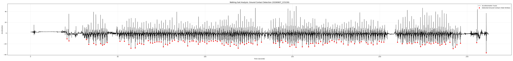

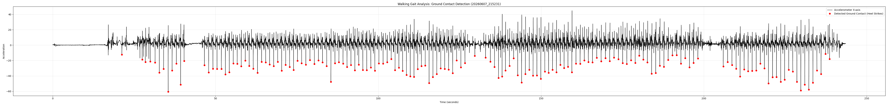

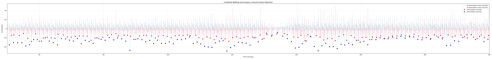

### Prediction comparison plots

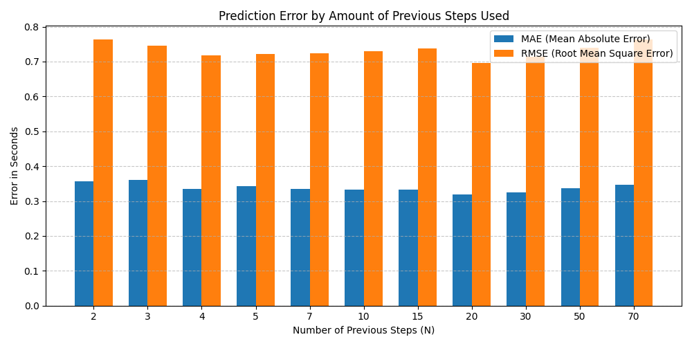

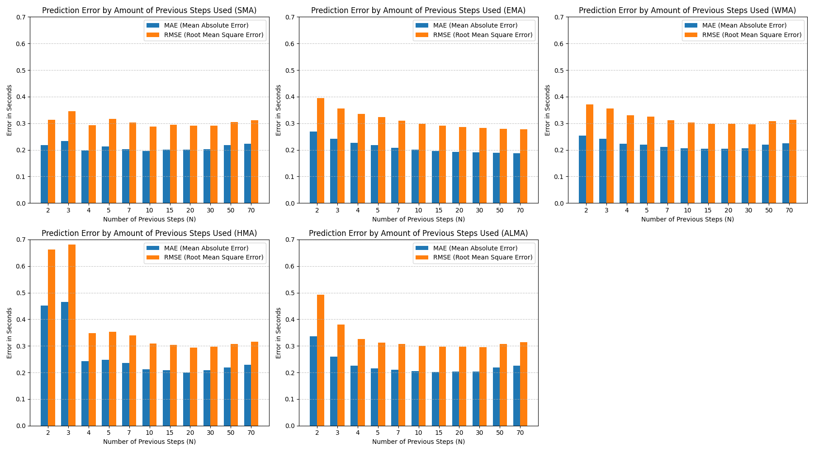

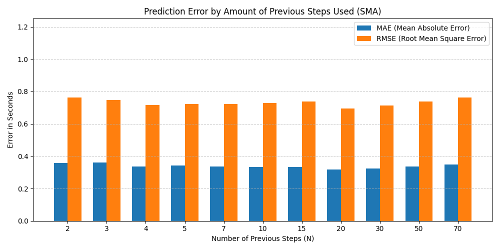

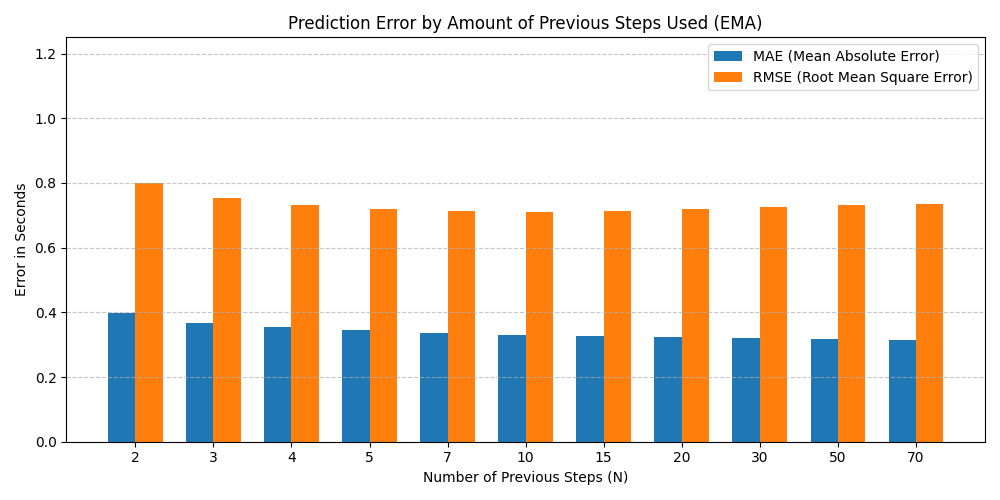

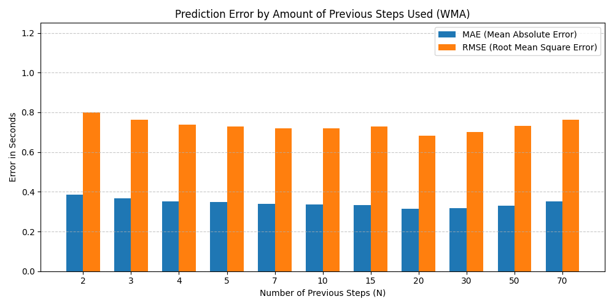

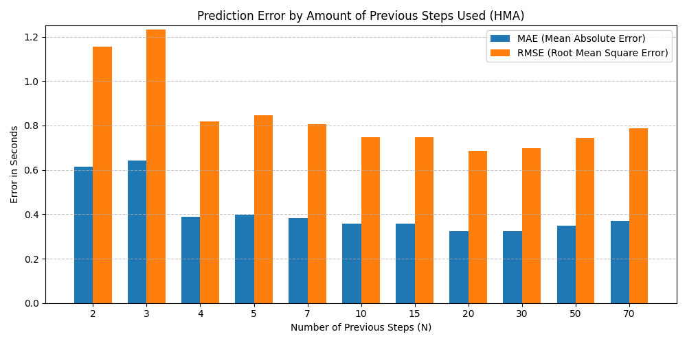

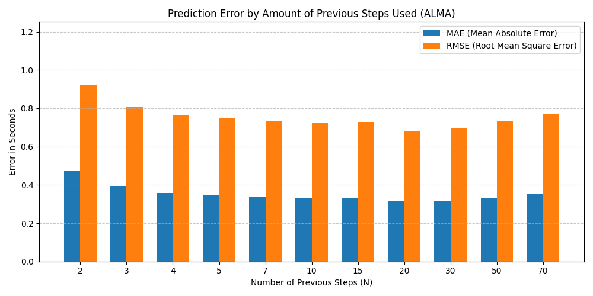

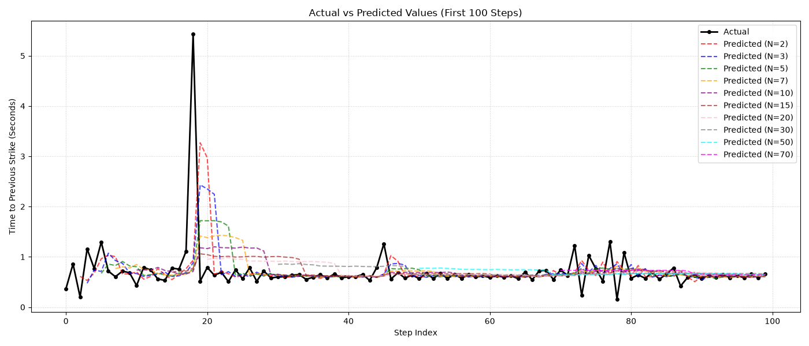

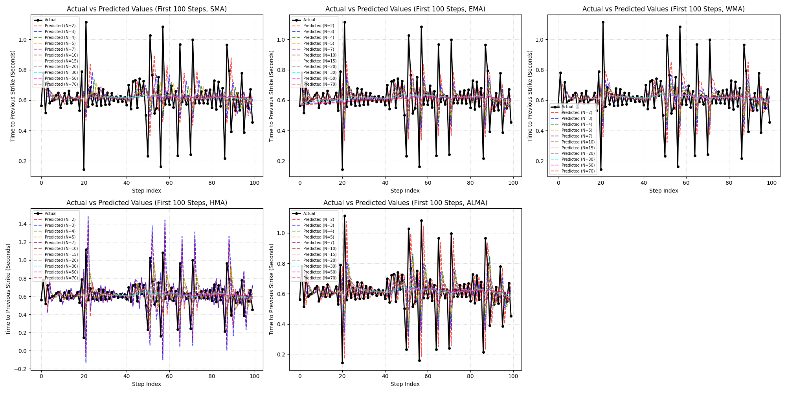

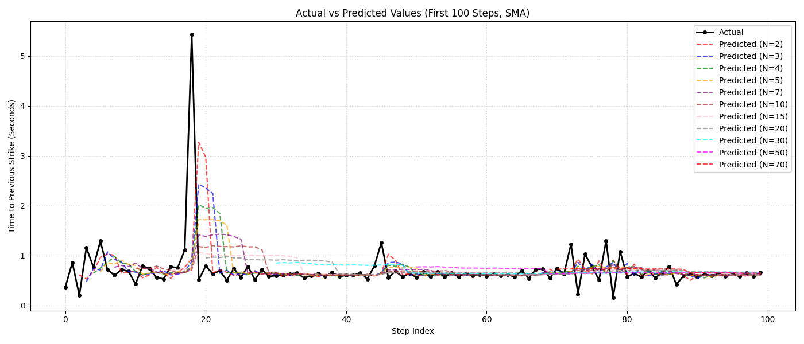

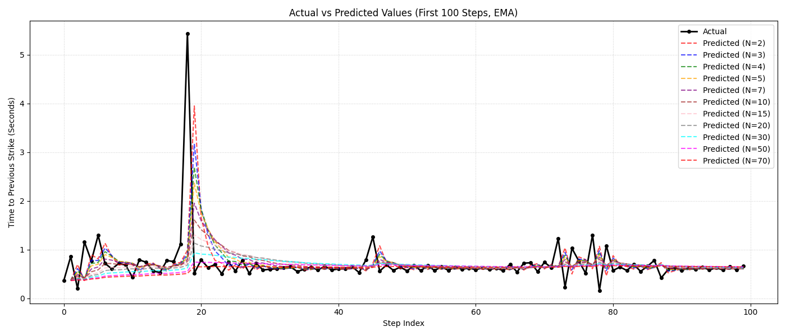

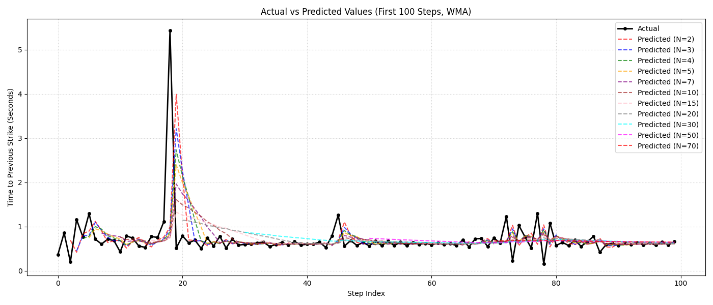

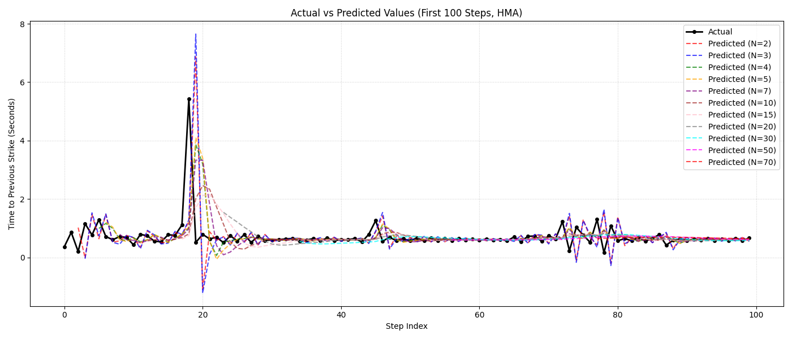

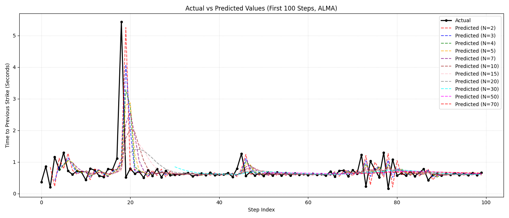

---

## Notes

- The repository is primarily a local analysis project and data notebook-style workflow rather than a packaged application.
- Scripts are designed to run from their respective folders unless paths are updated.
- Most outputs are generated CSVs and PNG charts saved alongside the source data.

---

## Quick Summary

This repo tracks a complete pipeline for:

1. loading raw sensor data
2. identifying gait events (heel strikes)
3. aligning multiple recordings in time
4. generating a combined stride dataset
5. comparing prediction algorithms using moving-average approaches
6. exporting visual reports for interpretation
